<div align="center">


<br/>



</div>

<br/>

<div align="center">

### Building reasoning systems, not just applications.

M.Tech Computer Science student focused on **Agentic AI**, **LLM Applications**, and **Distributed Backend Systems**.
I design AI agents that plan, reason, and act — and the infrastructure that lets them scale.

<br/>

<a href="https://github.com/AchyuthNamburi"></a>
<a href="https://linkedin.com/in/YOUR-LINKEDIN-HANDLE"></a>
<a href="mailto:your.email@example.com"></a>
<a href="https://your-portfolio-link.com"></a>

</div>

<br/>

## About Me

```yaml
role:        M.Tech Computer Science Student
focus:       AI Engineering · Agentic AI · LLM Systems
goal:        AI Engineer / Software Engineer @ a top product company
currently:   Building multi-agent systems with LangGraph + RAG pipelines
philosophy:  "Ship systems that reason, not just respond."
```

<br/>

## Tech Stack

<table width="100%">
<tr>
<td valign="top" width="50%">

**Languages**


</td>
<td valign="top" width="50%">

**AI / LLM Engineering**


</td>
</tr>
<tr>
<td valign="top" width="50%">

**Backend & Systems**


</td>
<td valign="top" width="50%">

**Data & Infra**


</td>
</tr>
</table>

<br/>

## Areas of Interest

<table width="100%">
<tr>
<td width="33%" valign="top">

**Agentic AI**
Multi-agent orchestration, tool-using agents, planning & reasoning loops

</td>
<td width="33%" valign="top">

**LLM Applications**
RAG pipelines, retrieval architectures, evaluation & grounding

</td>
<td width="33%" valign="top">

**System Design**
Distributed systems, scalable backend architecture, API design

</td>
</tr>
<tr>
<td width="33%" valign="top">

**Machine Learning**
Deep learning, computer vision, applied model engineering

</td>
<td width="33%" valign="top">

**Backend Engineering**
High-performance services, clean architecture, observability

</td>
<td width="33%" valign="top">

**Open Source**
Contributing to and maintaining developer tooling

</td>
</tr>
</table>

<br/>

## Currently Learning


<br/>
<br/>

<table width="100%">
<tr>
<td width="50%" valign="top">

### [AI-Based Differentiation of ARDS vs PCE](https://github.com/AchyuthNamburi/AI-Based-Differentiation-of-ARDS-vs-PCE)

Deep learning framework for differentiating ARDS and Pulmonary Cardiogenic Edema from lung ultrasound images using CNNs and explainable AI techniques.


</td>

<td width="50%" valign="top">

### [Colorectal Polyp Detection & Segmentation](https://github.com/AchyuthNamburi/AchyuthNamburi-Colorectal-Polyp-Detection-and-Segmentation)

Attention U-Net with MobileNetV2 encoder for automated colorectal polyp segmentation using medical image datasets.


</td>
</tr>

<tr>

<td width="50%" valign="top">

### [AI Resume Screener](https://github.com/AchyuthNamburi/ai-resume-screener)

LLM-powered resume analysis system that evaluates resumes against job descriptions and provides intelligent candidate insights.


</td>

<td width="50%" valign="top">

### [CodeRoom](https://github.com/AchyuthNamburi/CodeRoom)

Collaborative real-time coding platform featuring synchronized code editing, execution, and multi-user collaboration.


</td>
</tr>
</table>
## GitHub Statistics

<div align="center">


<br/>


<br/>


</div>

<br/>

## Connect With Me

<div align="center">

<a href="https://github.com/AchyuthNamburi"></a>
<a href="https://linkedin.com/in/YOUR-LINKEDIN-HANDLE"></a>
<a href="mailto:your.email@example.com"></a>
<a href="https://your-portfolio-link.com"></a>

</div>

<br/>

<div align="center">


<sub>Designed for clarity, not clutter — every section above earns its place.</sub>
</div>
